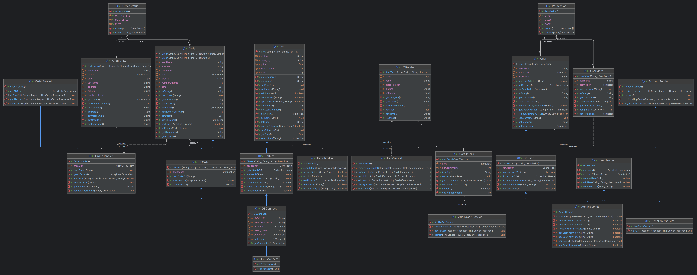
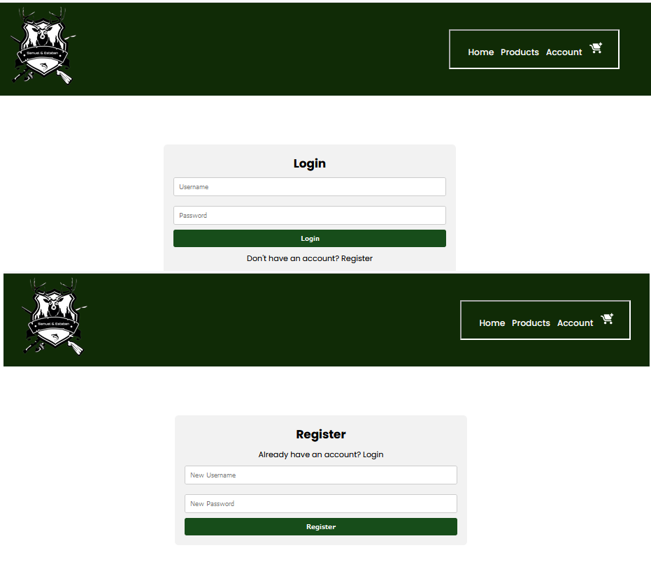
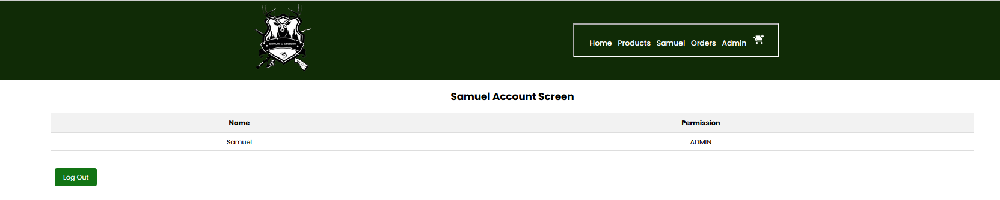
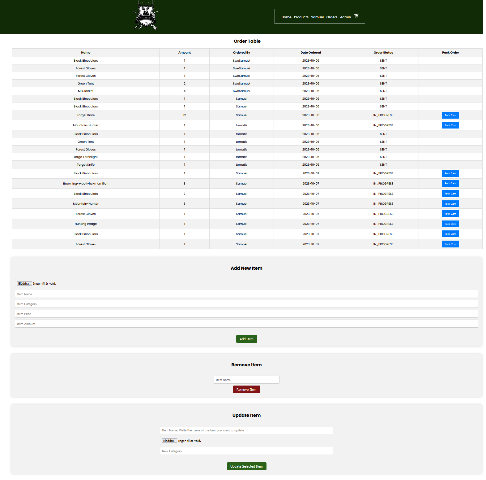
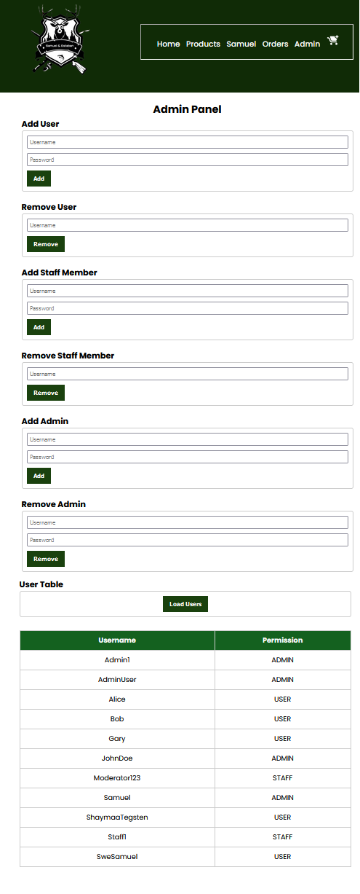
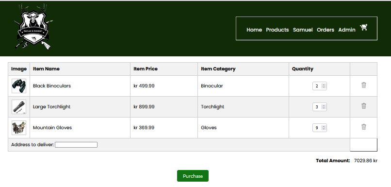

<h1 align="center">Samuel & Esteban WebShop</h1>

<h1 align="center">Description</h1>
<p align="center">
  Welcome to the Samuel & Esteban WebShop project! This web application is designed to provide a seamless shopping experience for users. Below, you'll find an overview of the different sections of the web view.
</p>

---

<h1 align="center">Business Objects, Database, and Controllers</h1>

<p align="center">
  
</p>

---

<h1 align="center">View</h1>

<h2 align="center">Index.jsp</h2>
<p align="center">
  
  <br>
  Description: The index page of our web application.
</p>

---

<h2 align="center">Product.jsp</h2>
<p align="center">
  
  <br>
  Description: The product page displaying items for sale.
</p>

---

<h2 align="center">Account.jsp</h2>
<p align="center">
  
  <br>
  Description: User account management page.
</p>

---

<h2 align="center">Success.jsp</h2>
<p align="center">
  
  <br>
  Description: Confirmation page for successful transactions.
</p>

---

<h2 align="center">Orders.jsp</h2>
<p align="center">
  
  <br>
  Description: View and manage user orders.
</p>

---

<h2 align="center">Admin.jsp</h2>
<p align="center">
  
  <br>
  Description: Admin panel for site management.
</p>

---

<h2 align="center">Cart.jsp</h2>
<p align="center">
  
  <br>
  Description: Shopping cart for users.
</p>

---

# Database Structure
```sql
CREATE DATABASE sql_webshop;
USE sql_webshop;

CREATE TABLE item (
    name VARCHAR(255) PRIMARY KEY,
    picture VARCHAR(255),
    category VARCHAR(255),
    price DECIMAL(10, 2) NOT NULL,
    stockNumber INT NOT NULL
);

CREATE TABLE user (
    username VARCHAR(255) PRIMARY KEY,
    password VARCHAR(255) NOT NULL,
    permission ENUM('USER', 'STAFF', 'ADMIN') NOT NULL,
    UNIQUE (username),
    UNIQUE (password)
);

CREATE TABLE `order` (
    order_id INT AUTO_INCREMENT PRIMARY KEY,
    username VARCHAR(255) NOT NULL,
    item_name VARCHAR(255) NOT NULL,
    number_of_items INT NOT NULL,
    address TEXT,
    status ENUM('IN_PROGRESS', 'SENT', 'COMPLETED') NOT NULL,
    order_date TIMESTAMP DEFAULT CURRENT_TIMESTAMP
);
